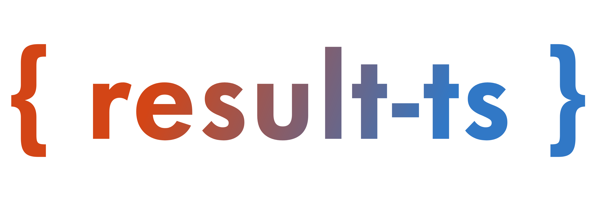

<p align="center">
    
    <p align="center">Rust's <code>Result</code> and <code>Option</code> types, for TypeScript.</p>
</p>

---

`results-ts` provides Rust-style [`Result`](./docs/api/type-aliases/Result.md) and [`Option`](./docs/api/type-aliases/Option.md) types with chainable methods. `Result<T, E>` represents a value or an error. `Option<T>` represents a value that may be absent.

<p align="center">
    <a href="https://npmx.dev/package/results-ts/v/latest"></a>
    <a href="https://npmx.dev/package/results-ts/v/canary"></a>
    <a href="https://results-ts.madkarma.top/"></a>
    <a href="https://github.com/madkarmaa/results-ts/actions/workflows/release.yml"></a>
</p>

## Installation

```bash
bun add results-ts
# or
npm install results-ts
# or
pnpm add results-ts
# or
deno add results-ts
# or
yarn add results-ts
```

## Usage

Return `Ok` or `Err`, then transform or handle the result:

```typescript
import { Ok, Err } from 'results-ts';

const parseUserId = (id: string) => {
    const parsed = parseInt(id, 10);
    if (isNaN(parsed))
        return Err({
            code: 'INVALID_INPUT',
            message: 'ID must be a valid number'
        } as const);

    if (parsed <= 0)
        return Err({
            code: 'INVALID_ID',
            message: 'ID must be positive'
        } as const);

    return Ok(parsed);
};

const message = parseUserId('10')
    .map((id) => id + 3)
    .andThen((id) => Ok({ id, name: 'Alice', role: 'admin' }))
    .match({
        Ok: (user) => `Welcome, ${user.role} ${user.name}!`,
        Err: (error) => `Validation Error: ${error.message}`
    });

console.log(message);
```

## Documentation

See the [guides and API reference](https://results-ts.madkarma.top).

## Contributing

See [CONTRIBUTING.md](./CONTRIBUTING.md) for setup and pull request requirements.

## Attribution

- [Web Dev Simplified](https://www.youtube.com/@WebDevSimplified), concept from [this video](https://www.youtube.com/watch?v=ovnyeq-Xxrc).
- [vultix/ts-results](https://github.com/vultix/ts-results)
- [supermacro/neverthrow](https://github.com/supermacro/neverthrow)

## Contributors

[](https://github.com/madkarmaa/results-ts/graphs/contributors)

## License

[MIT License](./LICENSE).
